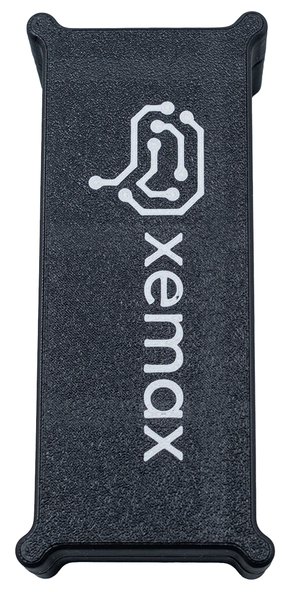
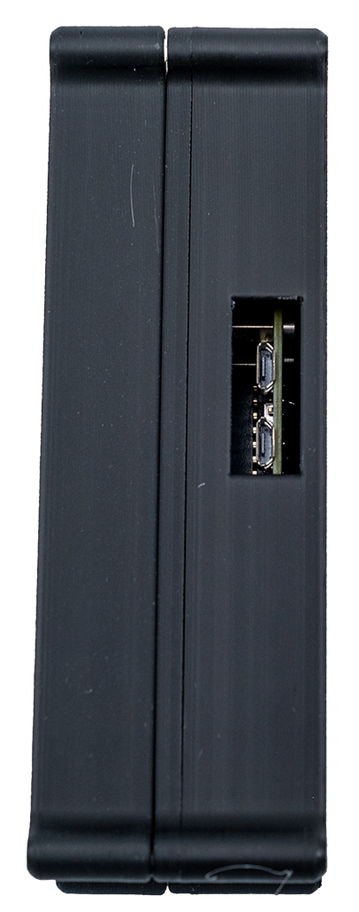
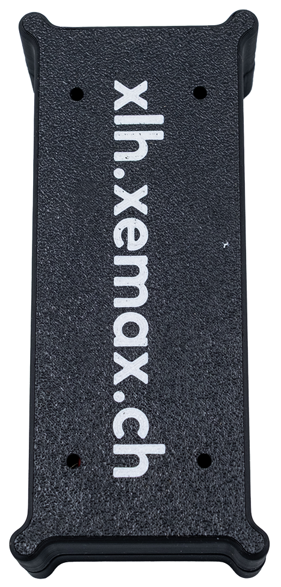
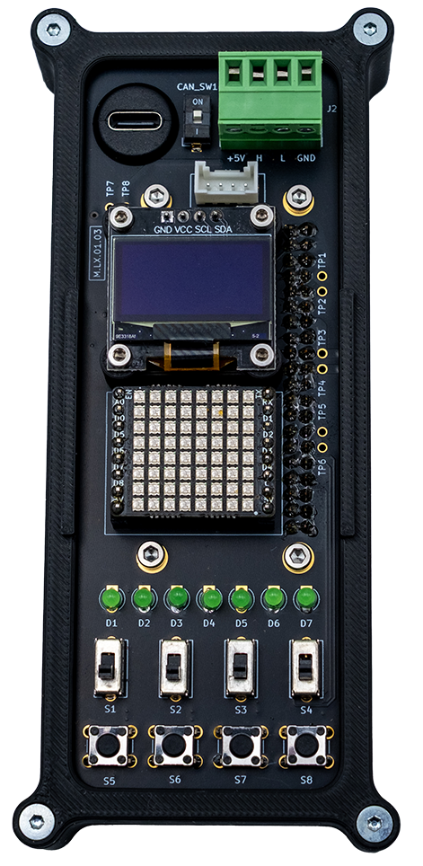
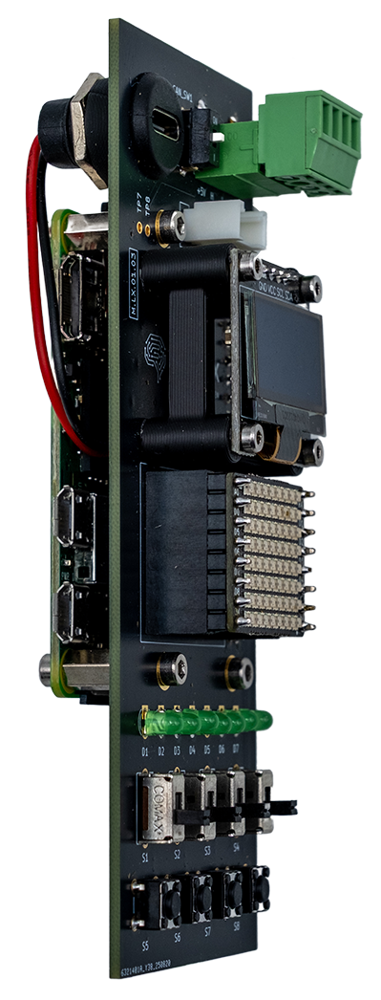
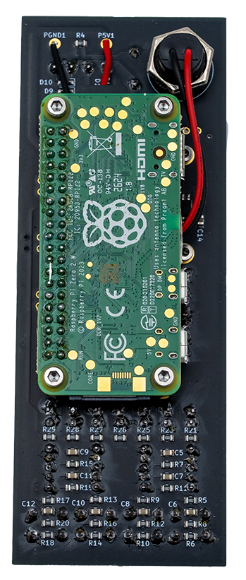
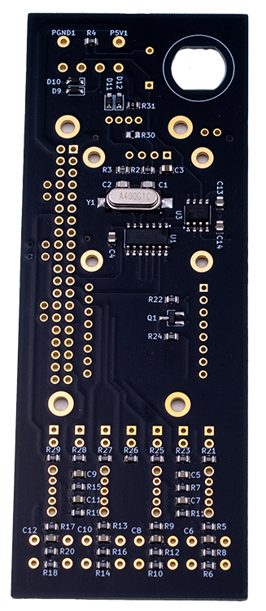
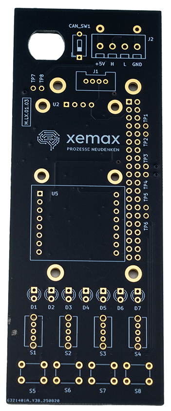
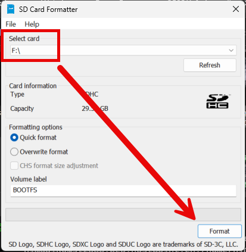
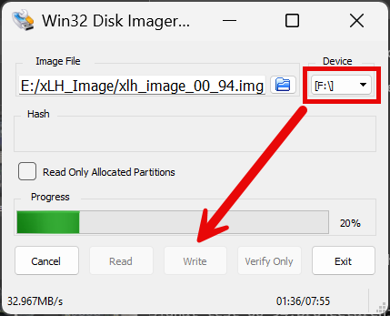

# xLH-base
<table>
  <tr>
    <td>
      
    </td>
    <td>
      
    </td>
    <td>
      
    </td>
    <td>
      
    </td>
    <td>
      
    </td>
    <td>
      
    </td>
    <td>
      
    </td>
    <td>
      
    </td>
  </tr>
</table>

## Codesys Signal Test
Downloadlink: <a href="https://xlh-files.xemax.ch/source/codesys/xlh_base/xlh_base_signal_test_00_94.projectarchive" target="_blank">xlh_base_signal_test_00_94.projectarchive</a>
login details  
username: xlh  
password: xlh  

## Codesys Development Environment
Downloadlink: <a href="https://xlh-files.xemax.ch/software/CODESYS_64_3.5.21.30.exe" target="_blank">CODESYS_64_3.5.21.30.exe</a>

## xLH Linux Image
Downloadlink: <a href="https://xlh-files.xemax.ch/image/xlh_image_00_94.img" target="_blank">xlh_image_00_94.img</a>

<table>
  <tr>
    <td>
      
    </td>
    <td>
      
    </td>
  </tr>
</table>

1. Download Image
2. Format SD Card (<a href="https://xlh-files.xemax.ch/software/SD_Card_Formatter_5.0.3_Setup EN.exe" target="_blank">SD_Card_Formatter_5.0.3_Setup EN.exe</a>)
3. Write Image to SD Card (<a href="https://xlh-files.xemax.ch/software/win32diskimager-1.0.0-install.exe" target="_blank">win32diskimager-1.0.0-install.exe</a>)