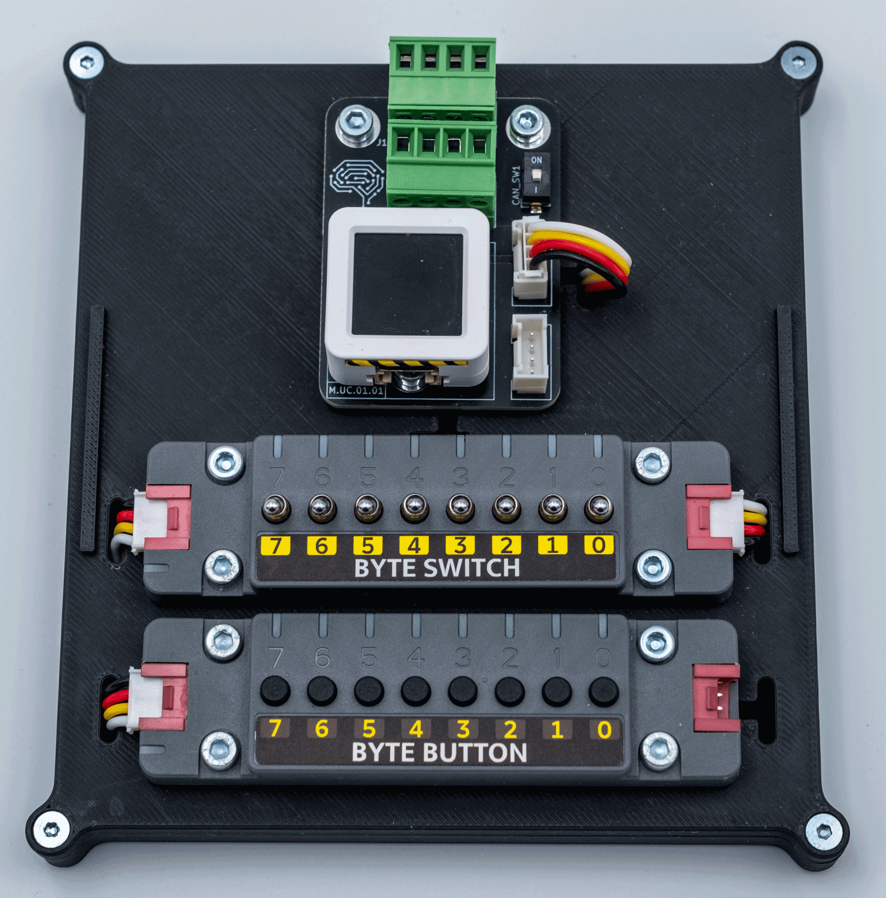

# xLH-stamp: button-switch-led

## Firmware
[1002_xLH_stamp_digital_switch_button_led_00_04.zip](firmware/1002_xLH_stamp_digital_switch_button_led_00_04.zip
<a href="firmware/1002_xLH_stamp_digital_switch_button_led_00_04.zip" download="MyNewFileName.zip">1002_xLH_stamp_digital_switch_button_led_00_04.zip</a>
<a href="firmware/1002_xLH_stamp_digital_switch_button_led_00_04.zip">1002_xLH_stamp_digital_switch_button_led_00_04.zip</a>
<a href="firmware/1002_xLH_stamp_digital_switch_button_led_00_04.bin>1002_xLH_stamp_digital_switch_button_led_00_04.bin</a>